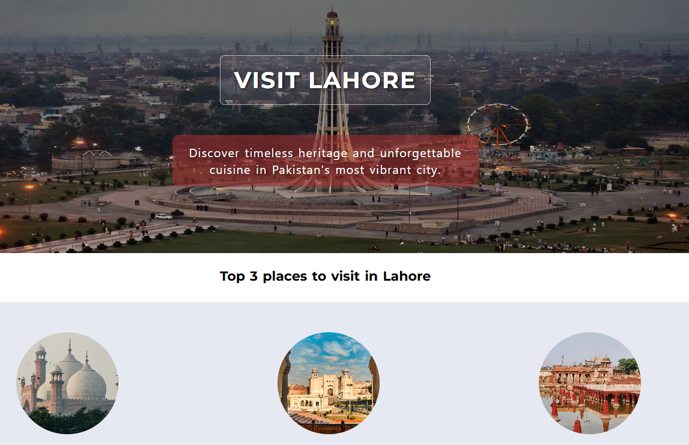

# 🏠 Hometown Homepage

A responsive hometown homepage for Lahore, Pakistan, created using HTML and CSS.

The website showcases Lahore's famous landmarks and introduces a local guide through an interactive profile card with a 3D flip effect.

## 📸 Screenshot

## 🚀 Features

- Lahore-themed hometown homepage
- Hero section with a Lahore background image
- Featured places to visit
- Badshahi Mosque
- Lahore Fort
- Shalimar Gardens
- Local guide profile card
- 3D flip card effect
- Contact information on the back of the card
- Hover animations
- Responsive design
- Mobile-friendly layout

## 🛠️ Technologies Used

- HTML5
- CSS3
- Flexbox
- CSS Grid
- CSS Transforms
- CSS Transitions
- Responsive Web Design
- Google Fonts

## 🎯 Purpose

This project was created to practice building a complete responsive webpage using HTML and CSS.

It focuses on:

- Semantic HTML structure
- CSS layouts
- Flexbox
- Responsive design
- Background images
- Image styling
- Hover effects
- CSS transitions
- 3D transforms
- Interactive UI elements

## 📂 Project Structure

Hometown-Homepage/
│
├── index.html
├── style.css
├── myCity.jpg
├── bmos.jpg
├── fort.jpg
├── garden.jpg
├── myPicture.jpeg
├── myCity.png
└── README.md

## 💻 How to Run

1. Clone the repository.
2. Open the project folder.
3. Open `index.html` in your browser.

No additional dependencies or installation are required.

## 👨‍💻 Author

**Hamza Saeed**

GitHub: [Code-with-Humza](https://github.com/Code-with-Humza)

For your GitHub repository description, I'd use:

**Responsive Lahore hometown homepage built with HTML & CSS featuring famous landmarks, a local guide, and an interactive 3D flip card.**

